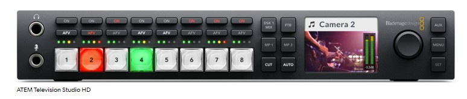
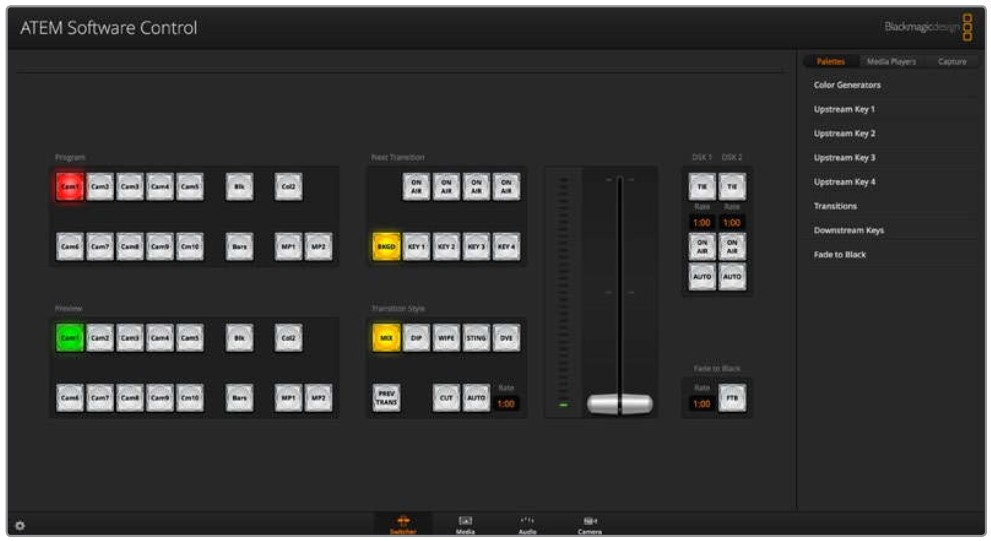
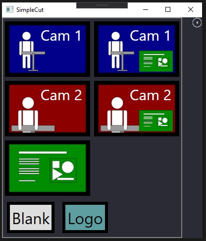
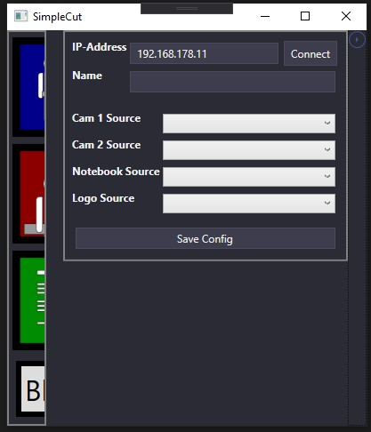

# SimpleCut

A Atem Switcher operator software that simplifies operation for inexperienced users.

This mini tool aims to break down the whole functionality of an Atem Switcher for a particular case to enable unexperienced users to operate the switcher during the service. The currently used Swticher is shown in the next picture.

Actually it can be quite challenging to teach a loan the usage of a switcher so he can use it  just for a few events, especially if you self are not an expert in this field. To simplify the training and the operation itself this tool aims to simplify the GUI shown in the next picture which is possible because in our case actually only a small subset of the features is used.

The result are just five buttons that enable the operator to switch smoothly between full shot, medium shot and presentation. Which are are three different input sources in first place.  The resulting GUI is shown in the next picture.

At first start firstly the IP address is required to connect the GUI. After a successful connect you can setup the sources for the different target. By saving the configuration a file is created in the directory by the executable. On the next startup the configuration is loaded automatically an the connection is setup if possible.

The picture in Picture mode enable a upstream key that is setup accordingly.

# Implementation
- This project is based on the *Blackmagic ATEM Switchers SDK 8.2.2* (can be downloaded from  [support center](https://www.blackmagicdesign.com/de/support/)). 
- To enable the development the Switcher apperently must be installed too *ATEM v8.2.2.msi*
- The GUI is powered by [AdonisUI](https://github.com/benruehl/adonis-ui) 

# Requiremens
To enable the simple operation the switcher firstly hast to be setup accordingly. The currently used setup is also included to the project.

# Disclaimer

This software was tested with an Atem Television Studio HD, with the firmware-version 8.2.2.

It's pretty at the beginning of it's development, the are barely sophisticated error catch routines implemented. Hence an invalid state can be forced if the view is switched between picture-in-picture and camera only an the fading time is not awaited. 

# ToDo

1. The whole thing must made more robust, problem is that a have rarely access to the switcher.
2. After black is selected some sort of notification should be visible, since this mode actually can only be left by clicking on black again.
3. We also need a transparent view for our Presentation if only text is shown 
4. Transition time should be configurable, the transition should be also visibly by process bar to prevent to give feedback to the operator
